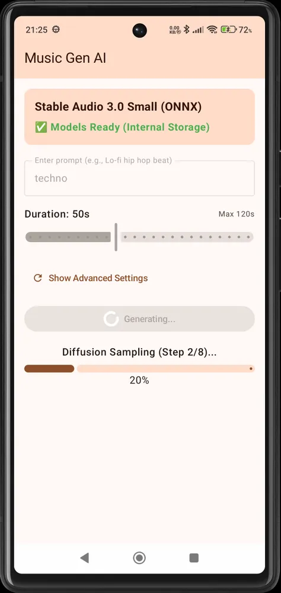
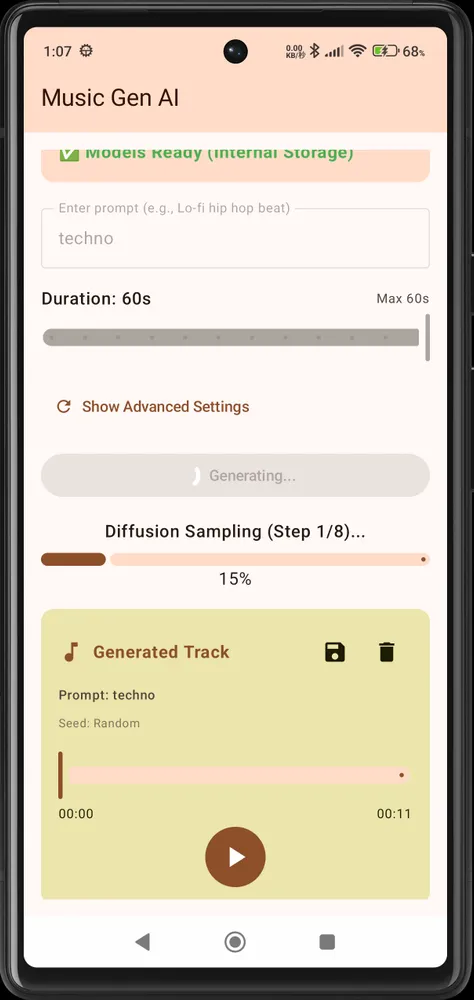

# TNGW Music Generating AI (Open Source Edition)

TNGW Music Generating AI is an Android application that allows you to generate high-quality music directly on your device using state-of-the-art AI models. This open-source edition provides the core generation engine and UI for the community to explore and build upon.

## Screenshots

  
  

## Key Features

- **On-Device Generation**: All music generation happens locally on your Android device using ONNX Runtime. No cloud processing required after the initial model download.
- **Text-to-Music**: Simply enter a prompt describing the music you want (e.g., "Lo-fi hip hop with a relaxing piano melody") and watch the AI create it.
- **Advanced Parameters**: Control the generation process with parameters like CFG Scale, Steps, and Seed.
- **Music History**: Keep track of your generated tracks, replay them, and share them easily.
- **Modern UI**: Built with Jetpack Compose for a smooth and responsive user experience.

## Technical Details

The application leverages the following technologies:
- **Kotlin & Jetpack Compose**: For a robust and modern Android implementation.
- **ONNX Runtime (Mobile)**: Used for efficient local inference of the Diffusion Transformer (DiT) models.
- **T5Gemma Tokenizer**: A custom implementation of the T5Gemma tokenizer for processing text prompts.
- **Media3 ExoPlayer**: For high-quality audio playback and management.

### AI Model Integration
本アプリの音楽生成には、Stability AIが開発した **stable-audio-3-small-music** モデルを利用しています。なお、本アプリは個人の開発者によって提供されるオープンソースプロジェクトであり、Stability AIの公式アプリケーションではなく、同社からの公式な推奨や提携を受けているものではありません。

### Model Credits

This project is made possible by the incredible work of the AI research community. We would like to express our deep respect and gratitude to:

- **Stability AI**: For developing the [**stable-audio-3-small-music**](https://huggingface.co/stabilityai/stable-audio-open-1.0) model.
- **lsb (Hugging Face)**: For providing the quantized [**stable-audio-3-small-music-onnx**](https://huggingface.co/lsb/stable-audio-3-small-music-onnx) models, which enable this application to run efficiently on mobile devices. 

## Getting Started

### Prerequisites
- Android device with at least 4GB of RAM (8GB+ recommended).
- Android 10 (API level 29) or higher.

### Installation
1. Clone this repository.
2. Open the project in Android Studio.
3. Build and run the `app` module on your device.

*Note: On the first run, the app will download the necessary model files (~1GB) to your device's internal storage.*

## License

### Source Code
The source code of this project is licensed under the **Apache License 2.0**. See the [LICENSE](LICENSE.md) file for more details.

### AI Models
The AI models used in this application are subject to their respective licenses:
- **Stable Audio Open**: Licensed under the [Stability AI Community License](LICENSE_STABILITY.md) (see also [original on Hugging Face](https://huggingface.co/stabilityai/stable-audio-3-small-music/blob/main/LICENSE.md)).
- **Gemma/T5Gemma**: Subject to the [Gemma Terms of Use](LICENSE_GEMMA.md).
